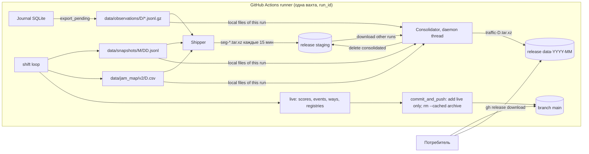

# Design: release-archive-publishing

**Created:** 2026-09-17 · **Requirements:** [requirements.md](requirements.md) · **Tasks:** [tasks.md](tasks.md)

## Overview

Публикация делится на два канала. Git (`main`) получает только компактные
live-представления. Тяжёлые архивные потоки идут в GitHub Releases двумя шагами:
каждые 15 минут приращение упаковывается в неизменяемый **сегмент** (актив
prerelease `staging`), а после закрытия дня сегменты и локальные файлы
собираются в один **дневной архив** `traffic-YYYY-MM-DD.tar.xz` в месячном
релизе `data-YYYY-MM`. Сегменты — промежуточная durable-очередь, замещающая
роль, которую сегодня играют 15-минутные git-коммиты.

Новый модуль `collector/publish.py` инкапсулирует всё взаимодействие с Releases.
`collector/shift.py` получает три точки интеграции: отгрузка в экспортном цикле,
фоновая консолидация, изменённый `commit_and_push`.

## Архитектура



### Поток данных за сутки

1. Каждые 15 минут `run_shift` вызывает `journal.export_pending()`, затем `Publisher.ship()`: сканирует архивные потоки, находит неотгруженные байты, собирает `tar.xz`, загружает в `staging`, проверяет sha256 через API, продвигает состояние.
2. После отгрузки — `commit_and_push(include_events, drop_archive)`.
3. Затем `Publisher.maybe_consolidate()`: если есть закрытый неконсолидированный день и фоновая задача не идёт — стартует daemon-поток `Consolidator.run()`.
4. При остановке: финальный `ship()` и `commit_and_push()` выполняются до выхода; консолидация, если идёт, не ждётся (идемпотентна, повторится).

## Компоненты и интерфейсы

### `collector/publish.py`

```python
ARCHIVE_STREAMS = ("observations", "snapshots", "jam_map/v2")      # относительно data/
LIVE_PATHS = ("data/scores", "data/events", "data/jam_map/ways.json", "data/jam_map/registries")
STAGING_TAG = "staging"
CLOSE_MARGIN = timedelta(minutes=45)
SEGMENT_BYTES_CAP = 64 * 2**20

class ReleaseClient(Protocol):            # реализация GhReleases; в тестах FakeReleases
    def ensure_release(self, tag, title, notes, prerelease=False) -> None
    def list_assets(self, tag) -> dict[str, AssetInfo]          # name -> {id,size,digest,state}
    def upload(self, tag, path: Path) -> None                    # без --clobber
    def download(self, tag, name, dest_dir: Path) -> Path
    def delete_asset(self, tag, name) -> None

class GhReleases(ReleaseClient):          # subprocess gh, env GH_TOKEN/GH_REPO, timeout 120 c
class FakeReleases(ReleaseClient):        # tests/: dict tag -> name -> bytes, эмуляция digest

class Shipper:
    def __init__(self, data_dir, releases, run_id, *, consolidated: set[str], lock)
    def backlog_bytes(self) -> int
    def ship(self, now_utc) -> bool         # True если отгружено или нечего отгружать

class Consolidator:
    def __init__(self, data_dir, releases, run_id, *, consolidated, lock)
    def candidate_days(self, now_utc) -> list[str]   # закрытые, неконсолидированные
    def consolidate_day(self, day, workdir) -> dict   # build → upload → verify
    def cleanup_staging(self) -> int
    def run(self, now_utc) -> dict                    # все кандидаты, ошибки логируются

class Publisher:                          # фасад для shift.py
    def __init__(self, data_dir, releases=None, run_id=None)
    def ship(self, now_utc) -> bool
    def fully_shipped(self) -> bool
    def maybe_consolidate(self, now_utc) -> None      # запуск daemon-потока, если нужно
    def close(self) -> None
```

- `run_id`: `GITHUB_RUN_ID` из окружения, иначе `local-<hostname>-<pid>`.
- `day_of(path)`: `observations/D/...` → D; `snapshots/YYYY-MM/DD.jsonl` → `YYYY-MM-DD`; `jam_map/v2/D.csv` → D.
- `day_closed(day, now_utc)`: `now_utc >= datetime(day)+1d + CLOSE_MARGIN` (UTC).
- `month_tag(day)` → `data-YYYY-MM`; `day_asset(day)` → `traffic-YYYY-MM-DD.tar.xz`.

### Верификация загрузки

`list_assets` возвращает `digest` (`sha256:<hex>`) из REST API. После `upload`:
до 5 опросов с паузой 2 с, пока `digest` не появится; сравнение с локальным sha256.
Если `digest` отсутствует после опросов — сравнение `size`, предупреждение в лог.
Несовпадение → актив удаляется, попытка считается неудачной.

### `collector/shift.py` (изменения)

- `commit_and_push(*, include_events=True, drop_archive=False) -> bool`:
  `git add -- <существующие LIVE_PATHS, без data/events если not include_events>`;
  при `drop_archive`: `git rm -r -q --cached --ignore-unmatch -- data/observations data/snapshots data/jam_map/v2`;
  `pull --rebase --autostash`; остальное без изменений.
- `run_shift(..., git_enabled)`: создаёт `Publisher` только при `git_enabled`;
  цикл экспорта: `export_pending → publisher.ship → commit_and_push → maybe_consolidate`;
  `publication_ok = shipped and pushed`; `last_events_commit` для часового окна;
  финальный блок: `ship` → `commit_and_push(include_events=True, drop_archive=fully_shipped)`.

### `collector/publish.py` CLI

`python -m collector.publish status|ship|consolidate --data-dir DIR [--run-id ID]`.

## Модели данных

### Имя сегмента
`seg-<YYYYMMDDTHHMMSSZ>-<run_id>-<seq:04d>-<D1>[+<D2>...].tar.xz`. Сортировка по имени = порядок по времени создания.

### `manifest.json` внутри сегмента
| Поле | Тип | Описание |
|---|---|---|
| schema_version | int | 1 |
| run_id | str | идентификатор вахты |
| seq | int | порядковый номер сегмента внутри run |
| created_at | str | UTC ISO 8601 |
| days | [str] | дни, затронутые файлами |
| files | [FileRange] | см. ниже |

`FileRange`: `{path, offset, length, sha256, whole: bool}`; содержимое диапазона — член `files/<path>`.

### `data/.state/publish.json`
| Поле | Тип | Описание |
|---|---|---|
| schema_version | int | 1 |
| run_id | str | run, для которого валидны смещения |
| seq | int | следующий seq |
| shipped | {path: int} | отгруженная длина append-only файлов; для батчей — полный размер |

Файл принадлежит текущему run: если `run_id` в файле отличается — состояние сбрасывается (новый runner начинает с нуля; на постоянном хосте `--git` не используется).

### Дневной архив `traffic-D.tar.xz`
Члены: `MANIFEST.json`, `observations/D/<digest>.jsonl` (распакованные), `snapshots/D.jsonl`, `jam_map/v2/D.csv` (только существующие).

`MANIFEST.json`: `{schema_version: 1, day, built_at, run_id, members: [{path, size, sha256, lines}], sources: [segment names], local_run: bool, duplicates_dropped: int, gaps: [{run_id, path, expected_offset, got_offset}], observations: {count, by_source: {...}}}`.

### Релизы
| Тег | Тип | Название | Содержимое |
|---|---|---|---|
| `staging` | prerelease | `Staging segments (internal)` | сегменты; удаляются после консолидации |
| `data-YYYY-MM` | release | `Traffic data YYYY-MM` | `traffic-YYYY-MM-DD.tar.xz` по дню |

## Алгоритмы

### Shipper.ship
1. Сканировать потоки; для каждого файла: батч не в `shipped` → диапазон `[0,size)` whole; append-only `size > shipped[path]` → `[shipped, size)`. Пропускать дни из `consolidated`.
2. Сортировать по (день, путь); набирать до `SEGMENT_BYTES_CAP`.
3. Пусто → `True`. Иначе собрать `tar.xz` (preset 3) во временном каталоге `data/.state/segments/`, вычислить sha256.
4. `ensure_release(staging)`; если актив с таким именем существует — удалить; `upload`; верифицировать.
5. Успех → обновить `shipped`, `seq`, сохранить `publish.json`, удалить временный файл → `True`. Неуспех → удалить временный файл → `False`.

### Consolidator.run
1. `list_assets(staging)` → сегменты (имя → дни, run_id, время). `local_days` из файлов на диске.
2. Кандидаты: закрытые дни без актива в месячном релизе, по возрастанию.
3. Для дня D: скачать сегменты D других run во временный каталог, прочитать manifests; для текущего run — локальные файлы как единый диапазон `[0,size)`.
4. Сборка: для батчей — dedupe по пути, проверка sha256 при `whole`, распаковка gzip; для append-only — группировать по run (порядок по времени первого сегмента run, текущий run последний), внутри run сортировать по offset, отбрасывать дубликаты диапазонов, фиксировать разрывы; конкатенация; построчная дедупликация с сохранением первого вхождения (заголовок CSV — обычная строка, поэтому повтор заголовка отбрасывается).
5. Записать члены, `MANIFEST.json`, `tar.xz` (preset 6); `ensure_release(month)`; удалить незавершённый актив с тем же именем; `upload`; верифицировать.
6. Добавить D в `consolidated`; `cleanup_staging()`: удалить сегменты, все дни которых консолидированы.
7. Ошибки внутри дня логируются (`logger.exception` без секретов) и не прерывают обработку остальных дней.

### Порядок финализации вахты
`pool/map_pool shutdown` → `save_map` → `journal.export_pending()` → `publisher.ship()` → `commit_and_push()` → `health.json` → `journal.close()`. Консолидация в daemon-потоке; если идёт — в лог предупреждение о продолжении в следующей вахте.

## Обработка ошибок

| Сценарий | Поведение | Признак |
|---|---|---|
| `gh` не найден / `GH_TOKEN` пуст | `ship` → `False`; публикация неуспешна; стагнация 45 мин → код 1 | ERROR в логе |
| Таймаут `gh` (120 с) | попытка неуспешна, повтор в следующем цикле | WARNING |
| digest не совпал | удалить актив, `False` | ERROR |
| Актив уже существует (`starter`/другой размер) | удалить и загрузить заново | INFO |
| Ошибка сборки дня | день пропущен, повтор позже | ERROR (exception) |
| Разрыв смещений | архив собран, `gaps` в MANIFEST | WARNING |
| Дубликаты строк/диапазонов | отброшены, счётчик в MANIFEST | INFO |
| Релиз отсутствует | создать (`gh release create`) | INFO |
| Ограничение API 429 | как таймаут | WARNING |

## Стратегия тестирования

- **Unit (офлайн, `FakeReleases`)**: диапазоны и состояние Shipper (AC-2.1..2.4); закрытие дня; кандидаты; сборка из двух run + локальные (AC-3.1); идемпотентность (AC-3.2); незакрытый день (AC-3.3); cleanup (AC-3.4); ошибка API (AC-3.5); дедупликация строк и заголовков; распаковка батчей и sha256 в MANIFEST.
- **Git (локальный bare remote, как в `test_git_clean_index_still_pushes_pending_commit`)**: только live-пути в коммите (AC-1.1), отсутствующий путь (AC-1.2), `drop_archive` (AC-4.1/4.2), `include_events=False` (AC-5.1), autostash (AC-5.2).
- **shift**: `run_shift(once=True, git_enabled=True)` с патчами `commit_and_push` и `Publisher` — порядок вызовов и `publication_ok`.
- **GhReleases**: разбор JSON и построение аргументов с патчем `subprocess.run`; секреты не попадают в сообщения.
- CI без сети к GitHub API (FR-8, NFR-6).

## Технические решения

### Решение 1: сегменты в Releases вместо дневных архивов из git-коммитов
- **Вариант A** — продолжать 15-минутные коммиты, в конце дня архивировать и `git rm`: история продолжает расти на 12.5 МБ/сутки. Отклонён.
- **Вариант B** — ветка `live/<day>` с force-push и удалением: зависит от GC GitHub, две ветки в одном чекауте. Отклонён.
- **Вариант C (выбран)** — неизменяемые сегменты в prerelease `staging` + дневная консолидация: RPO прежний, история не растёт, активы неизменяемы, всё на официальном API.

### Решение 2: распакованный JSONL внутри `tar.xz`
gzip внутри xz не сжимается; распакованные батчи дедуплицируются кросс-файлово (повторяющиеся события каждые 5 минут). Имя `<digest>.jsonl` сохраняет идентичность: digest — sha256 распакованного содержимого, как и раньше.

### Решение 3: месячные релизы с дневными активами
365 релизов в год замусорили бы страницу Releases; 12 релизов × ~31 актив — обозримо, каждый дневной актив неизменяем.

### Решение 4: реестр событий в git раз в час
Снижает 2.8 → ≈0.7 МБ/сутки; потребитель в git видит реестр с задержкой ≤ 1 ч; полные данные всегда в журнале. Требует `pull --rebase --autostash`.

### Решение 5: `.gitignore` не добавляется в этом изменении
Старая вахта, дожившая до merge, при `git add -- data` молча пропустила бы новые батчи (untracked + ignored). Вместо этого новый код явно стейджит live-пути и убирает архивы из индекса. `.gitignore` добавляется отдельным коммитом после первой вахты на новом коде.

### Решение 6: консолидация в daemon-потоке
xz одного дня (~70 МБ raw) занимает десятки секунд; поток не должен блокировать опрос и watchdog. Daemon — чтобы завершение процесса не ждало xz при SIGTERM; шаг идемпотентен.

## Миграция и откат

- **Внедрение**: merge PR → текущая вахта дорабатывает на старом коде → преемник стартует на новом; первая вахта консолидирует 11 закрытых дней из чекаута (фоново, ≈10–15 мин CPU), отгружает открытый день сегментами, затем убирает архивные пути из индекса одним коммитом.
- **После первой вахты**: оператор добавляет `data/observations/`, `data/snapshots/`, `data/jam_map/v2/` в `.gitignore` (задача TSK-013).
- **Откат**: вернуть предыдущую версию кода; исторические файлы в git не тронуты (история не переписана); дневные архивы в Releases остаются как есть; сегменты `staging` можно консолидировать вручную `python -m collector.publish consolidate`.
