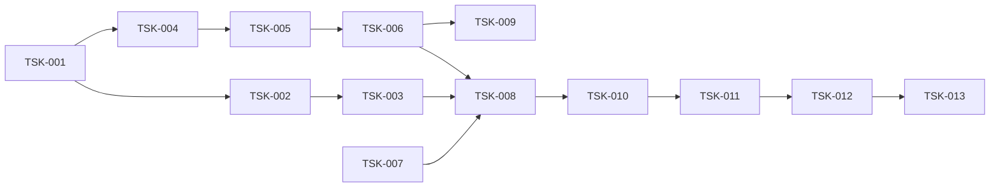

# Tasks: release-archive-publishing

**Created:** 2026-09-17 · **Requirements:** [requirements.md](requirements.md) · **Design:** [design.md](design.md)

## Стратегия

Foundation-first: клиент Releases и фейк → Shipper → Consolidator → интеграция в
`shift.py` и git → workflow и README → QA. Каждая задача сопровождается офлайн-тестами
в `tests/test_publish.py`; реальный GitHub не используется.

## Phase 1: Клиент и отгрузка сегментов

- [x] **TSK-001**: Клиент Releases и фейк для тестов
  - Requirement: FR-2, FR-3, NFR-4, NFR-6
  - Deliverables: `collector/publish.py` (`ReleaseClient`, `GhReleases`, `_gh`, `AssetInfo`), `tests/test_publish.py` (`FakeReleases`)
  - Acceptance: `GhReleases` строит команды `gh api`/`gh release upload|download|delete-asset|create` с `GH_TOKEN`/`GH_REPO` из окружения и таймаутом 120 с; ошибки не содержат токен; `FakeReleases` эмулирует digest и состояние `starter`.

- [x] **TSK-002**: Состояние отгрузки и сканирование приращений
  - Requirement: FR-2 (AC-2.4), NFR-5
  - Deliverables: `Shipper.__init__/_load_state/_save_state/pending`, `day_of`, `day_closed`
  - Acceptance: состояние в `data/.state/publish.json` сбрасывается при смене `run_id`; `pending` возвращает диапазоны append-only файлов и целые батчи; дни из `consolidated` пропускаются; лимит 64 МиБ соблюдается.

- [x] **TSK-003**: Сборка сегмента, загрузка и верификация
  - Requirement: FR-2 (AC-2.1..2.3), NFR-3
  - Deliverables: `Shipper.ship`, `build_segment`, `verify_asset`, `segment_name`
  - Acceptance: тесты AC-2.1..2.3 проходят; неверный digest не продвигает состояние; незавершённый актив удаляется перед загрузкой.

## Phase 2: Консолидация дня

- [x] **TSK-004**: Кандидаты, закрытие дня, месячные релизы
  - Requirement: FR-3 (AC-3.2, AC-3.3)
  - Deliverables: `Consolidator.candidate_days`, `month_tag`, `day_asset`, `ensure_release` с текстом описания релиза
  - Acceptance: незакрытый день пропущен; консолидированный день не пересобирается; релиз создаётся при отсутствии.

- [x] **TSK-005**: Сборка дневного архива
  - Requirement: FR-3 (AC-3.1), NFR-5
  - Deliverables: `Consolidator.build_day`, `assemble_append_only`, `MANIFEST.json`
  - Acceptance: порядок run A → B → локальные; дубликаты строк/заголовков отброшены; батчи распакованы и проверены по sha256; разрывы записаны в MANIFEST; тест AC-3.1.

- [x] **TSK-006**: Загрузка архива, cleanup staging, фоновая задача
  - Requirement: FR-3 (AC-3.4, AC-3.5), NFR-3
  - Deliverables: `Consolidator.consolidate_day/run/cleanup_staging`, `Publisher.maybe_consolidate` (daemon-поток, один одновременно)
  - Acceptance: cleanup удаляет только полностью консолидированные сегменты; исключение API не покидает поток; повторный вызов доводит день до конца.

## Phase 3: Интеграция в сборщик и git

- [x] **TSK-007**: `commit_and_push` — live-пути, drop archive, реестр раз в час, autostash
  - Requirement: FR-1, FR-4, FR-5
  - Deliverables: `collector/shift.py::commit_and_push`, `LIVE_PATHS`, тесты с локальным bare remote
  - Acceptance: AC-1.1, AC-1.2, AC-4.1, AC-4.2, AC-5.1, AC-5.2 проходят; существующие тесты git не сломаны.

- [x] **TSK-008**: Хуки в `run_shift` и порядок финализации
  - Requirement: FR-2, FR-3, FR-8, NFR-2, NFR-3
  - Deliverables: `run_shift` (Publisher при `git_enabled`, `ship` → `commit_and_push` → `maybe_consolidate`, часовое окно реестра, финальный блок)
  - Acceptance: тест `run_shift(once=True, git_enabled=True)` с патчами фиксирует порядок вызовов и `publication_ok`; без `--git` Publisher не создаётся.

- [x] **TSK-009**: CLI `python -m collector.publish`
  - Requirement: FR-7
  - Deliverables: `collector/publish.py::main` (`status|ship|consolidate`, `--data-dir`, `--run-id`)
  - Acceptance: `status` печатает backlog и кандидатов; ненулевой код при ошибке.

## Phase 4: Workflow, документация, QA

- [x] **TSK-010**: Workflow `collect.yml`
  - Requirement: FR-2, NFR-4
  - Deliverables: env `GH_TOKEN`, `GH_REPO` на шаге сбора (таймаут-обёртка — спека `collector-hardening-bugfix`)
  - Acceptance: YAML валиден; права `contents: write` не расширяются.

- [x] **TSK-011**: README
  - Requirement: FR-6
  - Deliverables: разделы «Данные и семантика», «Режимы работы», «Резервные копии»
  - Acceptance: описано, что в git, что в Releases, команды скачивания/проверки, правило закрытия дня, порядок внедрения и `.gitignore` после первой вахты.

- [x] **TSK-012**: QA
  - Requirement: все
  - Deliverables: прогон `pytest` (WSL), `compileall`, трассировка AC → тесты в этом файле
  - Acceptance: все тесты зелёные; таблица покрытия заполнена.

- [ ] **TSK-013** (после первой вахты на новом коде, выполняет оператор или следующая сессия): добавить архивные пути в `.gitignore`
  - Requirement: FR-4
  - Acceptance: `git status` чист на runner; `git add` не касается архивных потоков.

## Dependency graph

## Progress

| Task | Status |
|---|---|
| TSK-001 | Complete |
| TSK-002 | Complete |
| TSK-003 | Complete |
| TSK-004 | Complete |
| TSK-005 | Complete |
| TSK-006 | Complete |
| TSK-007 | Complete |
| TSK-008 | Complete |
| TSK-009 | Complete |
| TSK-010 | Complete |
| TSK-011 | Complete |
| TSK-012 | Complete |
| TSK-013 | Pending (после внедрения) |

## Evidence (2026-09-17)

- `tests/test_publish.py`: 17 тестов (naming, Shipper AC-2.1..2.4 + cap + gh failure, Consolidator AC-3.1..3.5 + gaps/partial lines, Publisher background, GhReleases scrubbing, git AC-1.1/1.2/4.1/4.2/5.1/5.2, run_shift order). Полный прогон в WSL Ubuntu, Python 3.14, pinned deps: **61 passed**; `compileall` OK.
- Read-only smoke реального `gh`: 404 → `None`/`{}` для отсутствующего релиза; `--paginate --slurp` на `cli/cli` разобран (22 актива, у всех sha256 digest). Найдена и исправлена декодировка вывода `gh` (явный UTF-8).
- Workflow: `GH_TOKEN`/`GH_REPO` на шаге сбора; YAML валиден.
- Внедрение: PR в `main`; TSK-013 выполняется после первой вахты на новом коде.
